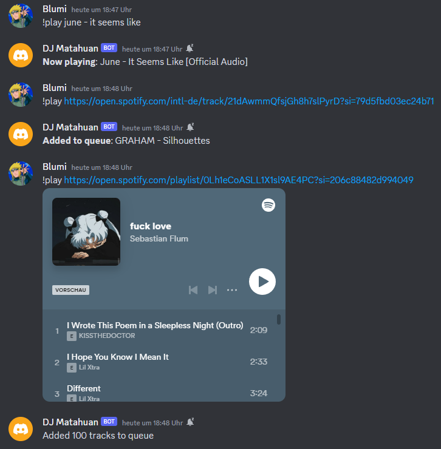
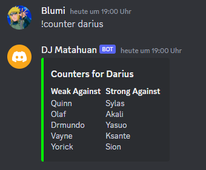
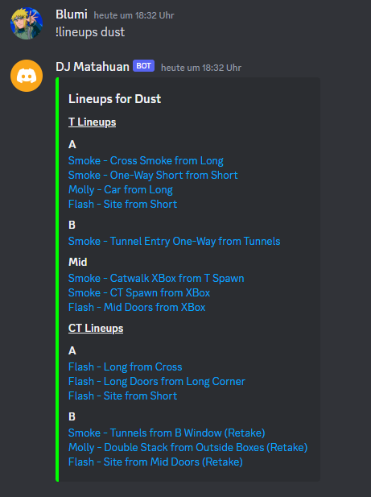
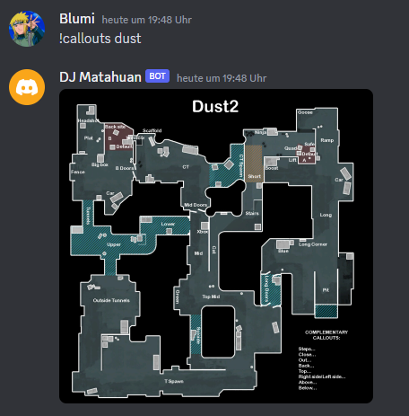
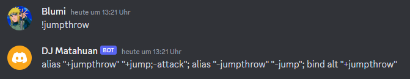
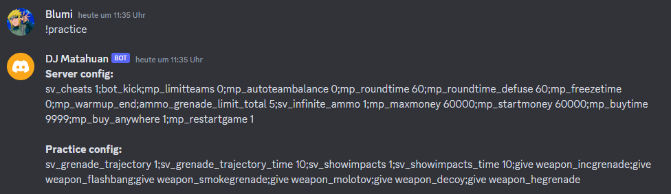

# Discord Bot

- [Features](#features)
  - [Music Player](#music-player)
  - [LoL Buddy](#lol-buddy)
  - [CS:GO Buddy](#csgo-buddy)
- [Getting Started](#getting-started)
  - [Exporting YouTube cookies for authentication](#exporting-youtube-cookies-for-authentication)
  - [Installing and configuring the bot](#installing-and-configuring-the-bot)
  - [Running the project](#running-the-project)
  - [(Optional) Create a CronJob](#optional-create-a-cronjob)

## Features

- [Music Player](#music-player)
- [LoL Buddy](#lol-buddy)
- [CS:GO Buddy](#csgo-buddy)

### Music Player



### LoL Buddy

#### Get counter champions for a League of Legends champion



### CS:GO Buddy

> [!NOTE] CS:GO buddy is a deprecated feature since CS:GO was replaced by CS2 in September 2023 (rip
> CS:GO, you will live on in our memories <\3).

#### Get lineups for a map



#### Get callouts for a map



#### Get the jumpthrow bind that you can paste into your console



#### Get the practice config that you can paste into your console



## Getting Started

### Exporting YouTube cookies for authentication

> [!IMPORTANT] Since a few months, YouTube steps up its measures for preventing bots accessing their
> content. Therefore, it is now necessary to provide some kind of login **if you want to run the bot
> on a remote VM**. If you want to run it on your local network, you should be fine.

In case you see the following error
`ERROR: [youtube] KQBRM1GK3T4: Sign in to confirm you’re not a bot. This helps protect our community.`,
you have to export your cookies and provide them to the discord bot for authenticating to YouTube.
Follow these steps:

1. Open a private browser window.
2. Sign in to your YouTube account.
3. Open a new tab and **close the YouTube tab**.
4. Export the cookies, e.g. by using a chrome or firefox extension capable of this.
5. Create the file `cookies.txt` in the repository root of the discord bot.
6. Copy the content of the **private window cookie file** into a the `cookies.txt` file you created
   in step 5.

### Installing and configuring the bot

> :memo: **Note:** This project uses Poetry for simple and consistent dependency management. If you
> want to learn more about Poetry see their [Introduction](https://python-poetry.org/docs/) or
> [Basic usage](https://python-poetry.org/docs/basic-usage/) documentation.

1. [Create a Discord Bot Account and invite the bot to your server](https://discordpy.readthedocs.io/en/stable/discord.html)

2. Create .env file with the following content:

   ```bash
   DISCORD_TOKEN = <your discord token>
   SPOTIFY_CLIENT_ID = <your spotify client id>
   SPOTIFY_CLIENT_SECRET = <your spotify client secret>
   ```

3. Install [FFmpeg](https://www.ffmpeg.org/)

   ```bash
   sudo apt update
   sudo apt install ffmpeg
   ```

4. Install Python and [pipx](https://github.com/pypa/pipx)

   ```bash
   sudo apt install python3
   sudo apt install pipx
   ```

5. Install [Poetry](https://python-poetry.org/docs/)

   ```bash
   pipx install poetry
   ```

6. Install project dependencies

   ```bash
   poetry install
   ```

### Running the project

1. Activate the Poetry shell

   ```bash
   poetry shell
   ```

2. Run the discord bot

   ```bash
   poetry run python discord_bot/bot.py
   ```

### (Optional) Create a CronJob

If you want to run the discord bot on a server (e.g. a Oracle cloud free tier VM running Ubuntu) you
can create a cron job that will automatically start the Discord bot upon each reboot. Run the
following commands from within the discord bot repository:

1. **Install the Poetry export plugin**:

   ```bash
   poetry self add poetry-plugin-export
   ```

2. **Create a `requirements.txt` file from the `poetry.lock` file**:

   ```bash
   poetry export -f requirements.txt --output requirements.txt
   ```

3. **Install the dependencies globally**:

   ```bash
   pip install -r requirements.txt
   ```

4. **Edit your crontab file**:

   ```bash
   crontab -e
   ```

5. **Add a Cronjob to use Poetry's environment on startup**:

   ```bash
   @reboot python3 /home/ubuntu/discord-bot/discord_bot/bot.py &
   ```

6. **Test**: Reboot the VM and see if the Discord bot starts up automatically.
